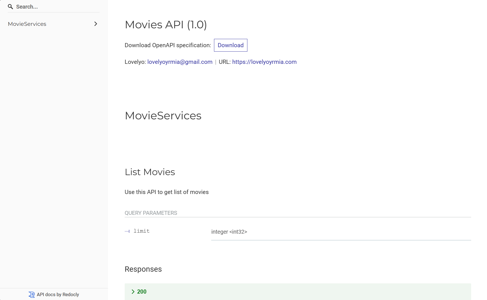

# Movies API Documentation

### Module : Go Version 1.21.6

### Server running on :
<a href="http://3.27.14.107:50054">Production</a>

This system is using GRPC and GRPC Gateway. The diagram below which explains how GRPC and gRPC Gateway work. 

## Tech Stack
[](https://www.microsoft.com/en-id/windows)  &nbsp;&nbsp;  [](https://www.linux.org/) &nbsp;&nbsp; [](https://wiki.debian.org/InstallingDebianOn/Microsoft/Windows/SubsystemForLinux)

<code></code> &nbsp;&nbsp; 
<code></code> &nbsp;&nbsp; 
<code></code>
&nbsp;&nbsp; 
<code></code>

### Other Tools:
- <a href="https://github.com/kyleconroy/sqlc#installation">SQLC</a>
- <a href="https://pkg.go.dev/github.com/golang/protobuf/protoc-gen-go">PROTOC</a>


This system is hosted on AWS EC2 and using github actions as a CI/CD Pipeline

## API Docs
This API Docs are built with Swagger and Redocs. To Access the API Docs can see the link below :

<a href="http://3.27.14.107:50054/docs">Link API Docs</a>



### Default Error Response
#### Base Response
```
{
    "code": integer,
    "message": string,
    "details": []
}
```
#### Validation Errors
```
{
    "code": integer,
    "message": string,
    "details": [
		{
			"@type": string,
			"field_violations": [
				{
					"field": string,
					"description": string
				}
			]
		}
    ]
}
```

### Error Code
There are some error codes used below: 
- 13 : (Internal Error)
- 10 : (Aborted)
- 5  : (Not Found)
- 3 : (Invalid Argument)
- 6 : (Already Exists)

### Services:
- Add Movie
- List Movies
- Detail Movie
- Update Movie
- Delete Movie

Example:
- To add a new movie
```
POST /movies

Body:
{
	"title": string,
	"description": string,
	"rating": float,
	"image": string
}

Response:
{
	"code": int,
	"message": string,
	"data": {
		"id": int,
		"title": string,
		"description": string,
		"image": string,
		"rating": float,
		"created_at": datetime,
		"updated_at": datetime
	}
}
```
- To get list of movies
```
/* limit can be optional */
GET /movies?limit=10

Response:
{
	"code": int,
	"message": string,
	"data": [
		{
			"id": int,
			"title": string,
			"description": string,
			"image": string,
			"rating": float,
			"created_at": datetime,
			"updated_at": datetime
		}
	]
}
```
- To get detail movie
```
/* Movie id paramater */
GET /movies/{id}

Response:
{
	"code": int,
	"message": string,
	"data": {
		"id": int,
		"title": string,
		"description": string,
		"image": string,
		"rating": float,
		"created_at": datetime,
		"updated_at": datetime
	}
}
```
- To update a movie
```
/* Movie id paramater */
PATCH /movies/{id}

Body:
{
	"title": string,
	"description": string,
	"rating": float,
	"image": string
}

Response:
{
	"code": int,
	"message": string,
	"data": {
		"id": int,
		"title": string,
		"description": string,
		"image": string,
		"rating": float,
		"created_at": datetime,
		"updated_at": datetime
	}
}
```
- To delete a movie
```
/* Movie id paramater */
DELETE /movies/{id}

Response:
{
	"code": int,
	"message": string,
	"data": null
}
```

## Get Started

To get started this API you need to setup infrastructure:

### Setup Infrastructre
- Run Postgresql in Docker
```
make postgres
```
- Create Database in Postgresql
```
make createdb
```
- Create New Migrations
```
make createmigrate
```
- Create New Migrations with specific name
```
make newmigration name={your migration name}
```
- Run Migrate Up 
```
make migrateup
```
- Run Migrate Down 
```
make migratedown
```

### Generate Code
- Generate SQL CRUD using SQLC 
```
make sqlc
```

- Generate Proto File to Golang Code
```
make proto
```

### Documentation
- Generate DB Docs
```
make dbdocs
```

### How To Run In Local Development
- Create Environment
```
app.env : for production
dev.env : for development
.env    : for mapping env
```
- Install All Packages
```
go mod tidy
```
OR
```
go mod download
```
- Run Seeder to generate dump products
```
make seed
```
- Run Server
```
make server
```